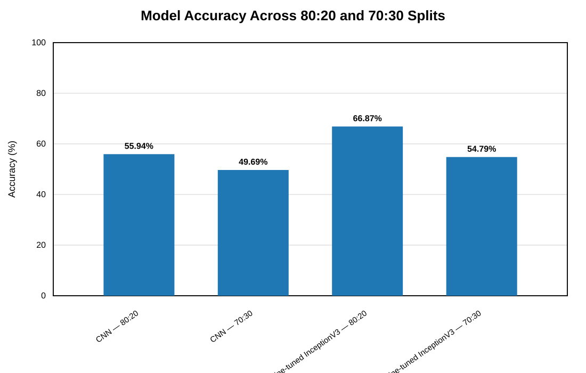
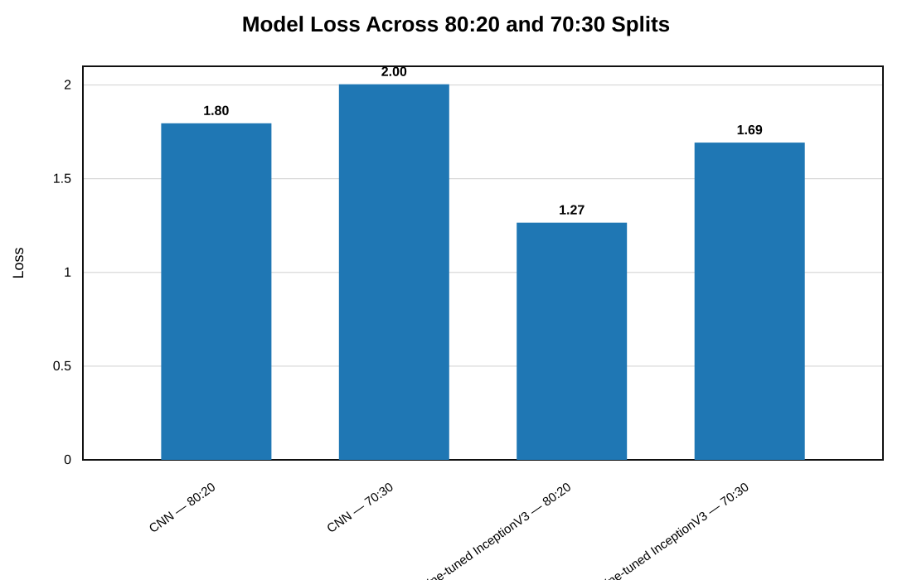
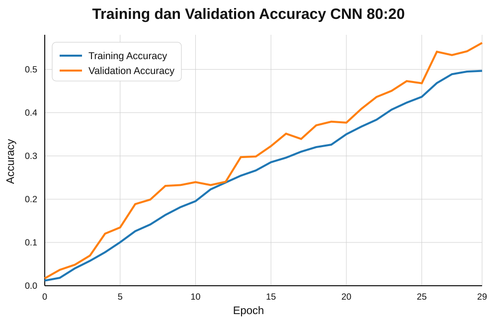
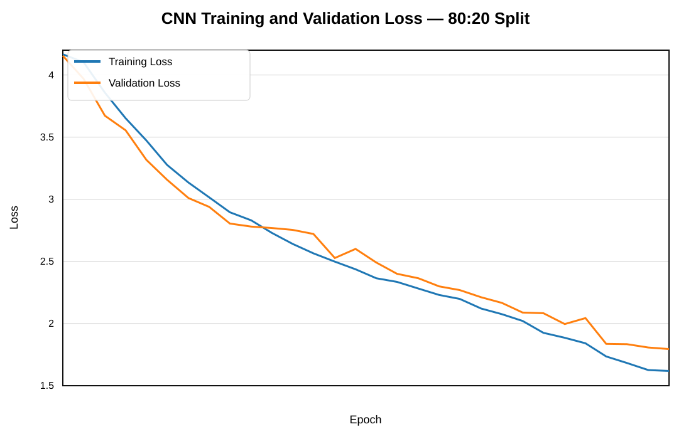
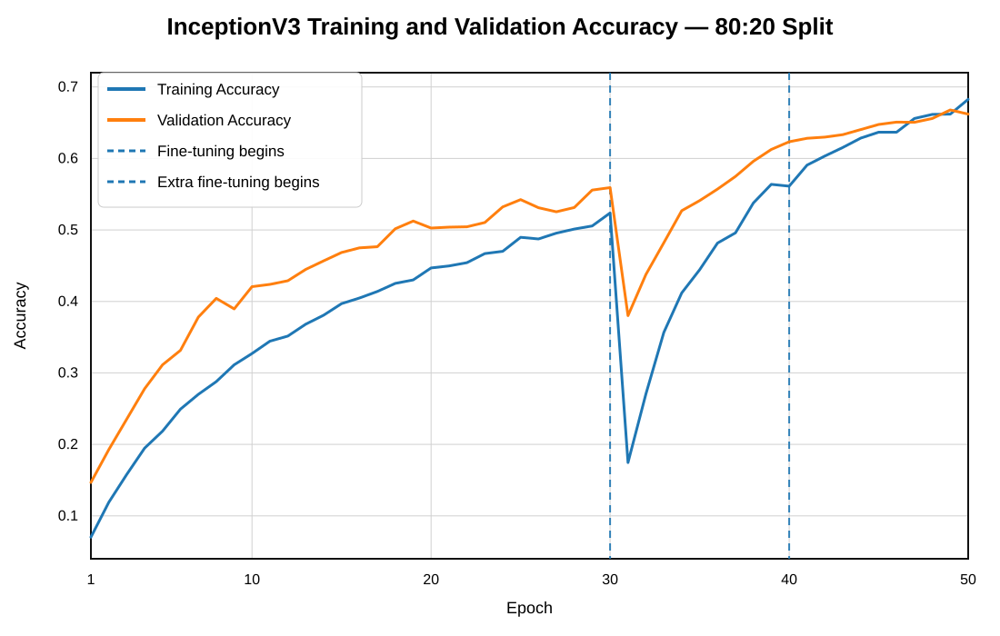
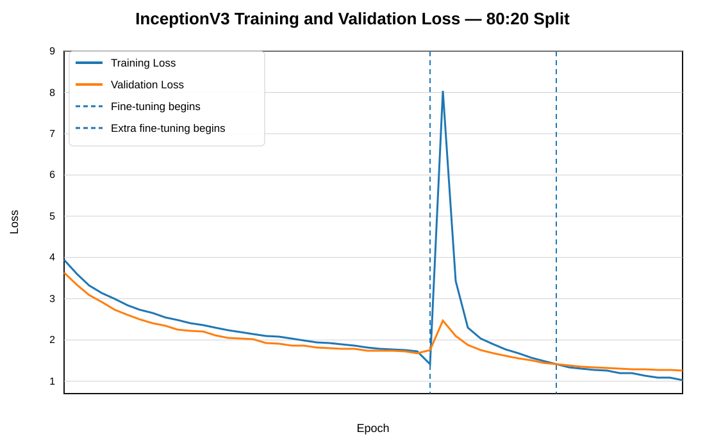
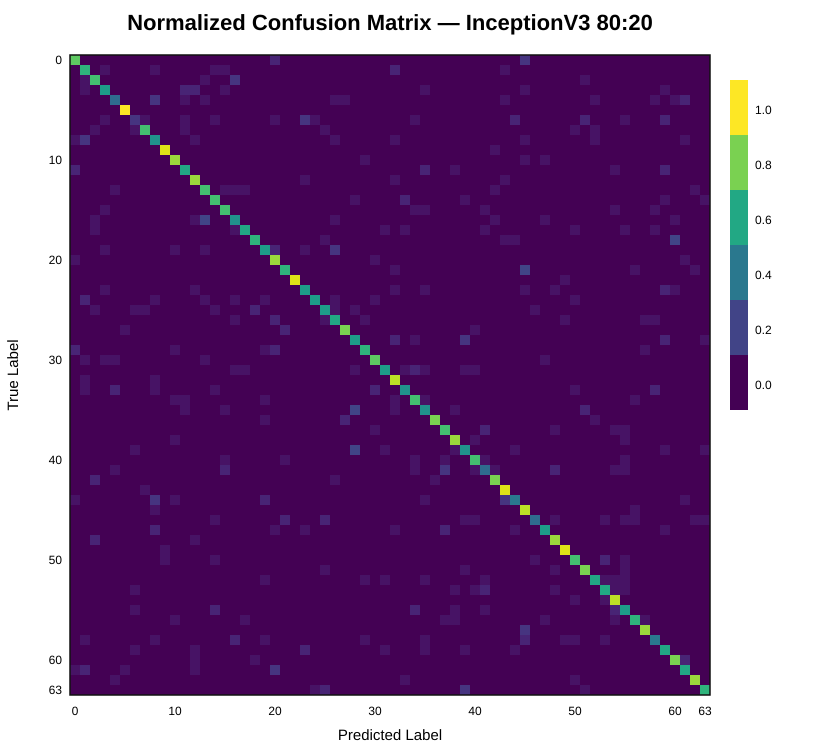
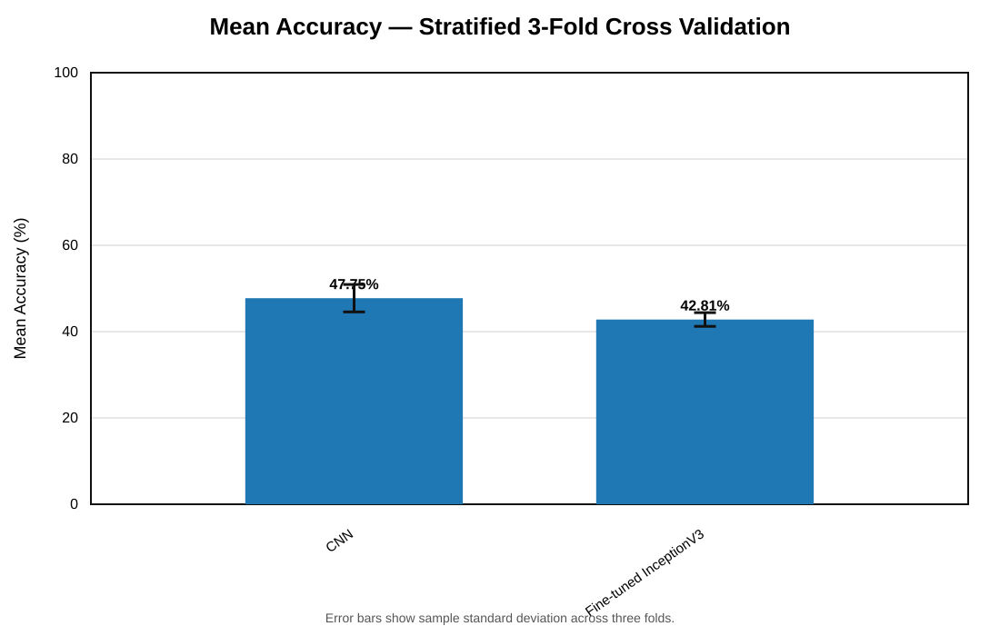

# Handwriting Writer Identification using Deep Learning

A deep learning project for **offline writer identification** from handwriting images using a custom Convolutional Neural Network (CNN) and transfer learning with InceptionV3.

Unlike handwriting recognition or OCR, this project does not focus on recognizing *what* is written. Instead, the objective is to identify **who wrote a handwriting sample** based on visual writing characteristics.

## Project Overview

This academic machine learning project compares two approaches for multi-class writer identification:

- **Custom CNN** trained from scratch as a baseline
- **InceptionV3** using transfer learning and staged fine-tuning

The goal was not only to train a classifier, but also to compare how a custom architecture and a pretrained visual feature extractor perform on the same handwriting identification task.

## Dataset

The dataset contains:

- **64 writers**
- **100 handwriting samples per writer**
- **6,400 handwriting images** in total

The data was prepared for multi-class classification and evaluated using stratified train-validation splits of **80:20** and **70:30**, together with **Stratified 3-Fold Cross Validation**.

> **Dataset Availability**
>
> The handwriting dataset was collected and provided by the course instructor for academic use. Due to distribution restrictions, the original dataset and derived data files are not included in this repository.

## Experimental Workflow

1. Audit and prepare the handwriting image dataset
2. Build class labels for the 64 writers
3. Create stratified train-validation splits
4. Resize images to 299 × 299 with aspect-ratio-preserving white padding and normalize pixel values
5. Train a custom CNN baseline
6. Apply transfer learning and staged fine-tuning with InceptionV3
7. Evaluate loss, accuracy, precision, recall, and F1-score
8. Perform additional Stratified 3-Fold Cross Validation
9. Compare model performance and training behavior

## Approaches

### Custom CNN

A convolutional neural network was developed and trained from scratch to learn writer-specific visual features directly from the handwriting images. The model contains four convolution and max-pooling blocks followed by global average pooling, a dense layer, dropout, and a 64-class softmax output.

### InceptionV3

InceptionV3 was initialized with ImageNet weights and adapted to the writer-identification task. Training used an initial frozen-feature-extractor stage followed by fine-tuning and an additional fine-tuning stage with smaller learning rates.

## Results

The project plots below are presented as sharp vector versions so they remain readable when viewed or zoomed on GitHub.

### Split Comparison



| Model | Split | Loss | Accuracy | Macro F1 |
| --- | --- | ---: | ---: | ---: |
| Custom CNN | 80:20 | 1.7958 | 55.94% | 54.59% |
| Custom CNN | 70:30 | 2.0040 | 49.69% | 46.62% |
| Fine-tuned InceptionV3 | 80:20 | **1.2659** | **66.87%** | **66.30%** |
| Fine-tuned InceptionV3 | 70:30 | 1.6929 | 54.79% | 53.16% |



Fine-tuned InceptionV3 achieved the strongest principal validation result on the 80:20 split, improving accuracy by **10.93 percentage points** over the CNN baseline while also reducing validation loss.

### Training Behavior — 80:20 Split

<table>
<tr>
<td width="50%"></td>
<td width="50%"></td>
</tr>
<tr>
<td align="center"><strong>Custom CNN — Accuracy</strong></td>
<td align="center"><strong>Custom CNN — Loss</strong></td>
</tr>
</table>

<table>
<tr>
<td width="50%"></td>
<td width="50%"></td>
</tr>
<tr>
<td align="center"><strong>InceptionV3 — Accuracy</strong></td>
<td align="center"><strong>InceptionV3 — Loss</strong></td>
</tr>
</table>

The InceptionV3 curves show the temporary accuracy drop and loss spike when fine-tuning begins around epoch 30 as pretrained weights are readjusted to the handwriting domain. Performance subsequently recovers and stabilizes during fine-tuning.

### Confusion Matrix



The 64 × 64 matrix represents the known writer classes. Fine-tuned InceptionV3 produced **856 correct predictions from 1,280 validation images** on the 80:20 split, consistent with the reported 66.87% validation accuracy.

### Stratified 3-Fold Cross Validation



| Model | Fold Accuracies | Mean ± SD | Mean Loss |
| --- | --- | ---: | ---: |
| Custom CNN | 50.84%, 47.91%, 44.49% | **47.75% ± 3.18%** | 1.8296 |
| InceptionV3 | 43.72%, 43.74%, 40.98% | 42.81% ± 1.59% | 2.1406 |

The cross-validation experiment used a **shorter, computationally constrained InceptionV3 training procedure** than the principal 80:20 experiment. These results therefore reflect both model behavior and unequal training budgets and should not be interpreted as evidence that the CNN is intrinsically superior under matched conditions.

### Key Finding

The principal split experiments show that transfer learning with fine-tuned InceptionV3 provided the strongest validation performance on this closed-set writer-identification task. The CNN remained a substantially smaller baseline, illustrating a clear performance-versus-complexity trade-off.

These results describe performance on writers represented in the dataset and should not be interpreted as identification performance for previously unseen writers.

## Technologies

- Python
- TensorFlow / Keras
- Scikit-learn
- Pandas
- NumPy
- Matplotlib
- Pillow
- Google Colab

## Setup

Install the core Python dependencies with:

```bash
pip install -r requirements.txt
```

The full experiment still requires authorized access to the private handwriting dataset and the corresponding local/Google Drive paths used by the notebook.

## What I Learned

Through this project, I explored:

- Image preprocessing for deep learning
- Multi-class image classification
- Designing and training convolutional neural networks
- Transfer learning and staged fine-tuning with InceptionV3
- Stratified dataset splitting and cross-validation
- Multi-class model evaluation and interpretation
- Performance-versus-complexity trade-offs
- Communicating experimental results without overgeneralizing model performance

## Repository Contents

- `writer_identification_cnn_inceptionv3.ipynb` — dataset preparation, model training, evaluation, and comparison
- `assets/model_accuracy_splits.svg` — validation accuracy comparison across both data splits
- `assets/model_loss_splits.svg` — validation loss comparison across both data splits
- `assets/curve_accuracy_cnn_80_20.svg` — CNN training/validation accuracy
- `assets/curve_loss_cnn_80_20.svg` — CNN training/validation loss
- `assets/curve_accuracy_inceptionv3_80_20.svg` — InceptionV3 training/validation accuracy and fine-tuning stages
- `assets/curve_loss_inceptionv3_80_20.svg` — InceptionV3 training/validation loss and fine-tuning stages
- `assets/confusion_matrix_inceptionv3_80_20.svg` — normalized 64-class confusion matrix
- `assets/model_accuracy_kfold.svg` — Stratified 3-Fold Cross Validation summary
- `requirements.txt` — core Python dependencies used by the project
- `.gitignore` — repository exclusions for private data, generated outputs, and local files

## Reproducibility Notes

The notebook contains placeholder paths for private dataset locations. Because the original handwriting dataset is not publicly distributable, the repository cannot reproduce the full experiment without authorized access to the source data.

The dependency file is intentionally kept lightweight and unpinned because the original Google Colab environment versions were not preserved as part of the experiment. The notebook and reported outputs are retained to document the experimental process and model comparison.

## Project Context

This project was developed as part of an academic machine learning project focused on applying deep learning to image-based classification and comparing a custom CNN with transfer learning.
